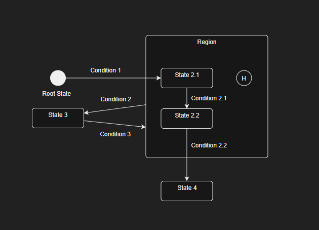

# Water Machine

> 水到渠成

Water Machine (WM) 是一个基于对场景的条件判断 自动流动的 有限状态自动机。

v1.0.3b  
by LviatYi

阅读该文档时，推荐安装以下字体：

- [JetBrainsMono Nerd Font Mono][JetbrainsMonoNerdFont]
- [Sarasa Mono SC][SarasaMonoSC]

若出现乱码，其为 Nerd Font 的特殊字符，不影响段落语义。

## Functional ⠄⠄⠄⠄⠄⠄⠄⠄⠄⠄⠄⠄⠄⠄⠄⠐⠒⠒⠒⠒⠚⠛⣿⡟⠄⠄⢠⠄⠄⠄⡄⠄⠄⣠⡶⠶⣶⠶⠶⠂⣠⣶⣶⠂⠄⣸⡿⠄⠄⢀⣿⠇⠄⣰⡿⣠⡾⠋⠄⣼⡟⠄⣠⡾⠋⣾⠏⠄⢰⣿⠁⠄⠄⣾⡏⠄⠠⠿⠿⠋⠠⠶⠶⠿⠶⠾⠋⠄⠽⠟⠄⠄⠄⠃⠄⠄⣼⣿⣤⡤⠤⠤⠤⠤⠄⠄⠄⠄⠄⠄⠄⠄⠄⠄⠄⠄⠄⠄⠄⠄

它旨在提供如下便利：

- [x] **小巧玲珑** 极简单的接口调用，只需要简单的包装、绑定。
- [x] **主观能动** 自动收集依赖，反向挂载更新，自动收集失效函数，永不阻断。

## Define ⠄⠄⠄⠄⠄⠄⠄⠄⠄⠄⠄⠄⠄⠄⠄⠐⠒⠒⠒⠒⠚⠛⣿⡟⠄⠄⢠⠄⠄⠄⡄⠄⠄⣠⡶⠶⣶⠶⠶⠂⣠⣶⣶⠂⠄⣸⡿⠄⠄⢀⣿⠇⠄⣰⡿⣠⡾⠋⠄⣼⡟⠄⣠⡾⠋⣾⠏⠄⢰⣿⠁⠄⠄⣾⡏⠄⠠⠿⠿⠋⠠⠶⠶⠿⠶⠾⠋⠄⠽⠟⠄⠄⠄⠃⠄⠄⣼⣿⣤⡤⠤⠤⠤⠤⠄⠄⠄⠄⠄⠄⠄⠄⠄⠄⠄⠄⠄⠄⠄⠄

WM 由一个五元组 $(\Sigma,S,R,s_0,\delta)$ 定义：

- $\Sigma$ 输入字母表。判断状态转换所需要的所有属性集合。
- $S$ 状态的非空有限集合。状态 $s$ 定义进入行为和退出行为。
- $R$ 区域的非空有限集合。区域 $r$ 是一个状态集合。
- $s_0$ 初始状态。
- $\delta$ 转移函数。定义 source ($s$) => dest ($d$) ($s,d \in S \bigcup R $ ) 转换的条件。

由定义可知：

- WM 并不关心终态。
- WM 定义初始状态，但其仍是一种状态，需要转换条件转出。
- 通过区域对状态进行分组。
- 一个状态可以被多个分组包含。



```typescript
class Sigma {
    public alpha: string;
    public beta: number;
}

const root = new State<Sigma>("root state");
const state21 = new State<Sigma>("state 2.1");
const state22 = new State<Sigma>("state 2.2");
const state3 = new State<Sigma>("state 3");
const state4 = new State<Sigma>("state 4");

const region = new Region<Sigma>("region");
region.include(state21, state22);

root.when(condition1).to(state21);
state21.when(condition21).to(state22);
state22.when(condition22).to(state4);
region.when(condition2).to(state3);
state3.when(condition3).to(region);
```

## Example ⠄⠄⠄⠄⠄⠄⠄⠄⠄⠄⠄⠄⠄⠄⠄⠐⠒⠒⠒⠒⠚⠛⣿⡟⠄⠄⢠⠄⠄⠄⡄⠄⠄⣠⡶⠶⣶⠶⠶⠂⣠⣶⣶⠂⠄⣸⡿⠄⠄⢀⣿⠇⠄⣰⡿⣠⡾⠋⠄⣼⡟⠄⣠⡾⠋⣾⠏⠄⢰⣿⠁⠄⠄⣾⡏⠄⠠⠿⠿⠋⠠⠶⠶⠿⠶⠾⠋⠄⠽⠟⠄⠄⠄⠃⠄⠄⣼⣿⣤⡤⠤⠤⠤⠤⠄⠄⠄⠄⠄⠄⠄⠄⠄⠄⠄⠄⠄⠄⠄⠄

移步 `./test/*`，根据示例构造你的有限状态自动机。

[JetbrainsMonoNerdFont]: https://github.com/ryanoasis/nerd-fonts/releases/download/v3.0.2/JetBrainsMono.zip@fallbackFont

[SarasaMonoSC]: https://github.com/be5invis/Sarasa-Gothic/releases/download/v0.41.6/sarasa-gothic-ttf-0.41.6.7z
