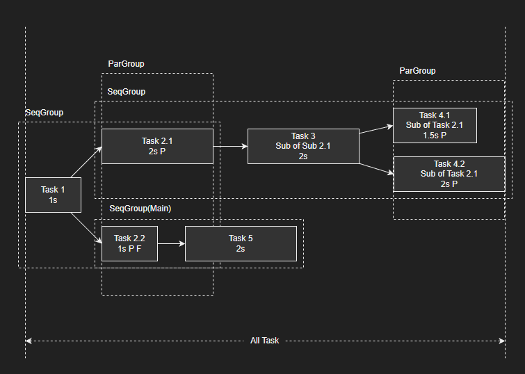

# Waterween

> 水包纳最流畅的动画.  
> Be water my friend. —— Bruce Lee.

一个由 Getter Setter 驱动的、专门面向 Meta World 的补间工具。目前处于开发阶段，并进行了小规模的测试。

v2.0.2b
by LviatYi

阅读该文档时，推荐安装以下字体：

- [JetBrainsMono Nerd Font
  Mono][JetbrainsMonoNerdFont]
- [Sarasa Mono SC][SarasaMonoSC]

若出现乱码，其为 Nerd Font 的特殊字符，不影响段落语义。

## Functional ⠄⠄⠄⠄⠄⠄⠄⠄⠄⠄⠄⠄⠄⠄⠄⠐⠒⠒⠒⠒⠚⠛⣿⡟⠄⠄⢠⠄⠄⠄⡄⠄⠄⣠⡶⠶⣶⠶⠶⠂⣠⣶⣶⠂⠄⣸⡿⠄⠄⢀⣿⠇⠄⣰⡿⣠⡾⠋⠄⣼⡟⠄⣠⡾⠋⣾⠏⠄⢰⣿⠁⠄⠄⣾⡏⠄⠠⠿⠿⠋⠠⠶⠶⠿⠶⠾⠋⠄⠽⠟⠄⠄⠄⠃⠄⠄⣼⣿⣤⡤⠤⠤⠤⠤⠄⠄⠄⠄⠄⠄⠄⠄⠄⠄⠄⠄⠄⠄⠄⠄

它旨在提供如下便利：

- [x] **信手拈来** 允许通过隐式单例轻松创建一个补间任务。
- [x] **成熟自持** 自动创建脚本 Behavior。无声地自动完成数据更新。
- [x] **纵横捭阖** 通过 setter 操控所有职责内的事务，函数赋你无所不能。
- [x] **大一统论** `group()` 函数，轻松构建任何树形节点动画。
- [x] **流水落花** `flow()` 函数，将 number 值的变化完全交给 Waterween，在二阶导数内抹除这个世界的尖锐。
- [x] **扶善遏过** 与编译底层深度合作的类型推断，避免不必要的对象属性或 typo。
- [x] **垂帘听政** 自适应数据弥合，支持仅对节点的部分维度进行控制，不必做微操大师。
- [x] **进退自如** 轻松 `󰐊播放`、`󰓕倒放`，无声、优雅地重置动画曲线。
- [x] **如绸如弦** 附赠强大的贝塞尔函数实现，并配套专业的贝塞尔数学支持，以 `@profession` 标注。
- [x] **雕梁画栋** 建造者模式，一砖一瓦地赋能 TweenTask。
- [x] **门户洞开** 观察者模式，完善的事件回调，信比季布的回调承诺。
- [x] **我们联合** 组合模式，按组进行共同更新，抑或将坏死限制在局部区域内。
- [x] **络绎不绝** 分组依序执行，大道轮回；抑或同步执行，齐头并进。
- [x] **水形无穷** 行为高客制化。允许自定义任何类型的数据插值策略，如使用四元数的 `slerp`。

## Deficiency ⠄⠄⠄⠄⠄⠄⠄⠄⠄⠄⠄⠄⠄⠄⠄⠐⠒⠒⠒⠒⠚⠛⣿⡟⠄⠄⢠⠄⠄⠄⡄⠄⠄⣠⡶⠶⣶⠶⠶⠂⣠⣶⣶⠂⠄⣸⡿⠄⠄⢀⣿⠇⠄⣰⡿⣠⡾⠋⠄⣼⡟⠄⣠⡾⠋⣾⠏⠄⢰⣿⠁⠄⠄⣾⡏⠄⠠⠿⠿⠋⠠⠶⠶⠿⠶⠾⠋⠄⠽⠟⠄⠄⠄⠃⠄⠄⣼⣿⣤⡤⠤⠤⠤⠤⠄⠄⠄⠄⠄⠄⠄⠄⠄⠄⠄⠄⠄⠄⠄⠄

然而它亦面临无法避免的难题：

- **熵之恶魔** Meta World 的熵之恶魔阻止行为之间的有序，因此 `Waterween` 可能存在 1 帧的数据精度问题。
    - 你可以成为英雄打败恶魔；亦可以手动调用 `Waterween.update()` 强制刷新数据，不过逃避亦有代价...
- **驹齿未落** Accessor Tween 目前处于羽翼渐丰的状态。

## State ⠄⠄⠄⠄⠄⠄⠄⠄⠄⠄⠄⠄⠄⠄⠄⠐⠒⠒⠒⠒⠚⠛⣿⡟⠄⠄⢠⠄⠄⠄⡄⠄⠄⣠⡶⠶⣶⠶⠶⠂⣠⣶⣶⠂⠄⣸⡿⠄⠄⢀⣿⠇⠄⣰⡿⣠⡾⠋⠄⣼⡟⠄⣠⡾⠋⣾⠏⠄⢰⣿⠁⠄⠄⣾⡏⠄⠠⠿⠿⠋⠠⠶⠶⠿⠶⠾⠋⠄⠽⠟⠄⠄⠄⠃⠄⠄⣼⣿⣤⡤⠤⠤⠤⠤⠄⠄⠄⠄⠄⠄⠄⠄⠄⠄⠄⠄⠄⠄⠄⠄

### Tween Task State

对于每个 Tween Task，具有如下状态：

- 播放状态
    - `󰐊播放`
    - `󰏤暂停`
    - `󰄲完成`
- 时序状态
    - `󰐊正放`
    - `󰓕倒放`
- 循环状态
    - 非循环
    - `重复` 完成后 `重置` 补间.
        - 你不应该在循环状态下访问 isDone.
- 往复状态
    - 非往复
    - `󱞳往复` `󰐊正放`结束后 `󰓕倒放`.

不同维度的状态相容，而各自的子状态之间互斥。

---

### Tween Task Group State

对于每个 Tween Task Group，具有如下状态：

- 播放状态
    - `󰐊播放`
    - `󰏤暂停`
    - `󰄲完成`
- 时序状态
    - `󰐊正放`
    - `󰓕倒放`
- 编排状态
    - `󰒿顺序`
    - `平行`
- 循环状态
    - 非循环
    - `重复` 完成后 `重置` 补间.
        - 你不应该在循环状态下访问 isDone.
- 往复状态
    - 非往复
    - `󱞳往复` `󰐊正放`结束后 `󰓕倒放`.

不同维度的状态相容，而各自的子状态之间互斥。

---

## Behavior ⠄⠄⠄⠄⠄⠄⠄⠄⠄⠄⠄⠄⠄⠄⠄⠐⠒⠒⠒⠒⠚⠛⣿⡟⠄⠄⢠⠄⠄⠄⡄⠄⠄⣠⡶⠶⣶⠶⠶⠂⣠⣶⣶⠂⠄⣸⡿⠄⠄⢀⣿⠇⠄⣰⡿⣠⡾⠋⠄⣼⡟⠄⣠⡾⠋⣾⠏⠄⢰⣿⠁⠄⠄⣾⡏⠄⠠⠿⠿⠋⠠⠶⠶⠿⠶⠾⠋⠄⠽⠟⠄⠄⠄⠃⠄⠄⣼⣿⣤⡤⠤⠤⠤⠤⠄⠄⠄⠄⠄⠄⠄⠄⠄⠄⠄⠄⠄⠄⠄⠄

### AutoDestroy

如果未设置 `autoDestroy(true)` ，需手动删除任务。

---

## Example ⠄⠄⠄⠄⠄⠄⠄⠄⠄⠄⠄⠄⠄⠄⠄⠐⠒⠒⠒⠒⠚⠛⣿⡟⠄⠄⢠⠄⠄⠄⡄⠄⠄⣠⡶⠶⣶⠶⠶⠂⣠⣶⣶⠂⠄⣸⡿⠄⠄⢀⣿⠇⠄⣰⡿⣠⡾⠋⠄⣼⡟⠄⣠⡾⠋⣾⠏⠄⢰⣿⠁⠄⠄⣾⡏⠄⠠⠿⠿⠋⠠⠶⠶⠿⠶⠾⠋⠄⠽⠟⠄⠄⠄⠃⠄⠄⣼⣿⣤⡤⠤⠤⠤⠤⠄⠄⠄⠄⠄⠄⠄⠄⠄⠄⠄⠄⠄⠄⠄⠄



```typescript
import Waterween from "./Waterween";

Waterween.group(
    getter,
    setter,
    [
        {dist: {task1: d1}, duration: task1Duration},
        {
            dist: {task2_1: d2_1}, duration: task2_1Duration, isParallel: true, subNode: [
                {dist: {task3: d3}, duration: task3Duration},
                {dist: {task4_1: d4_1}, duration: task4_1Duration, isParallel: true},
                {dist: {task4_2: d4_2}, duration: task4_2Duration, isParallel: true},
            ]
        },
        {dist: {task2_2: d2_2}, duration: task2_2Duration, isParallel: true, isFocus: true},
        {dist: {task5: d5}, duration: task5Duration}
    ]
);
```

[JetbrainsMonoNerdFont]:https://github.com/ryanoasis/nerd-fonts/releases/download/v3.0.2/JetBrainsMono.zip@fallbackFont

[SarasaMonoSC]:https://github.com/be5invis/Sarasa-Gothic/releases/download/v0.41.6/sarasa-gothic-ttf-0.41.6.7z