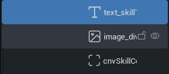

# MW UI Style Cheat Sheet | UI 开发风格规范

## 概述

MW UI Style Cheat Sheet 是 Meta World UI 开发时命名风格规范速查表，用于约束 UI 开发时无序的命名风格。

更推荐如下的命名风格：

- 以控件短前缀开头。
- 包含描述控件主要功能的词汇。
- 以 camel case 命名。
  - 即小驼峰法，首字母小写且单词首字母大写

如：

```
cnvMonsterDetail
```

为何要使用这样的命名风格？

- 以控件短前缀开头，可以在非 UI 编辑器（如代码编辑器）的环境中，更容易表明该名称的含义。  
  如，程序可以在代码编辑器中键入 `cnv`，随后可以通过提示快速筛选出想要使用的控件。
- mw 编辑器的 UI 设计哲学中，不惜违背生产力工具的寸土寸金原则，为不需要的 UI 元素留有大量空间：  
    
  这将意味着某些字符将被不必要的留空遮盖，使得更长的 UI 元素的命名变得不易阅读。  
  而不带 `_` 的命名规则使名称更加紧凑，在有限的空间中表达更多信息。
- 除非你真的确定一个 UI 控件在整个游戏过程中完全是静态的（永远不可能发生图片、文字的变化），则可以使用大写字母开头。

## 控件短前缀

| 控件名称     | 短前缀 |
| ------------ | ------ |
| 容器         | cnv    |
| 图片         | img    |
| 文本按钮     | btn    |
| 按钮         | btn    |
| 遮罩按钮     | btn    |
| 文本         | txt    |
| 输入框       | ipt    |
| 进度条       | pgr    |
| 加载图       | lod    |
| 滚动框       | scr    |
| 调色板       | pck    |
| 摇杆         | joy    |
| 摄像机滑动区 | tch    |
| 勾选框       | cck    |
| 下拉菜单     | drp    |
