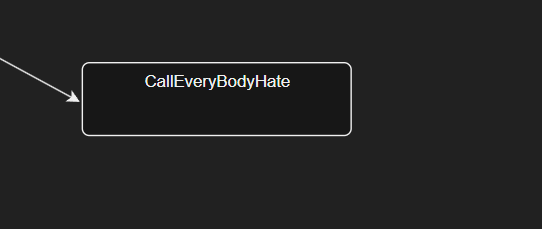
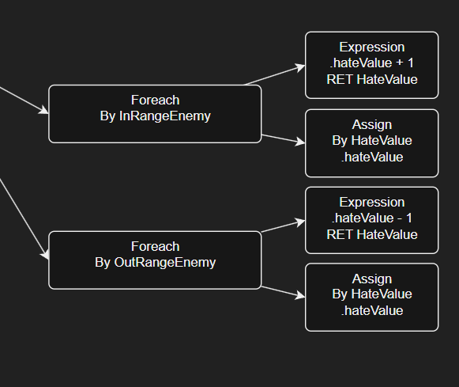
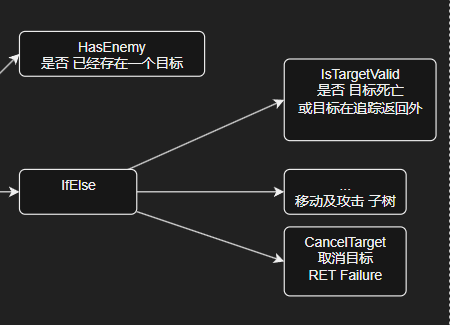
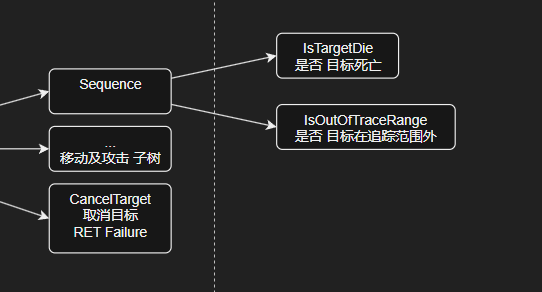

# BehaviorTree4Ts

面向 MW 编辑器的 Ts 行为树后端。

This lib is typescript version for [behavior3lua][b3lua], credit by [@zhandouxiaojiji][@zdxjj].  
The first TypeScript version of this library is ported from [@alphaAE][@alphaAE].

v36.1.0  
by [@zhandouxiaojiji][@zdxjj] Github  
by [@alphaAE][@alphaAE] Github  
by LviatYi
by ZeWei.Zhang

阅读该文档时，推荐安装以下字体：

- [JetBrainsMono Nerd Font Mono][JetbrainsMonoNerdFont]
- [Sarasa Mono SC][SarasaMonoSC]

若出现乱码，其为 Nerd Font 的特殊字符，不影响段落语义。

## Dependency ⠄⠄⠄⠄⠄⠄⠄⠄⠄⠄⠄⠄⠄⠄⠄⠐⠒⠒⠒⠒⠚⠛⣿⡟⠄⠄⢠⠄⠄⠄⡄⠄⠄⣠⡶⠶⣶⠶⠶⠂⣠⣶⣶⠂⠄⣸⡿⠄⠄⢀⣿⠇⠄⣰⡿⣠⡾⠋⠄⣼⡟⠄⣠⡾⠋⣾⠏⠄⢰⣿⠁⠄⠄⣾⡏⠄⠠⠿⠿⠋⠠⠶⠶⠿⠶⠾⠋⠄⠽⠟⠄⠄⠄⠃⠄⠄⣼⣿⣤⡤⠤⠤⠤⠤⠄⠄⠄⠄⠄⠄⠄⠄⠄⠄⠄⠄⠄⠄⠄⠄

- [exp-p][exp-p] Credit to [@adyfk]

## Functional ⠄⠄⠄⠄⠄⠄⠄⠄⠄⠄⠄⠄⠄⠄⠄⠐⠒⠒⠒⠒⠚⠛⣿⡟⠄⠄⢠⠄⠄⠄⡄⠄⠄⣠⡶⠶⣶⠶⠶⠂⣠⣶⣶⠂⠄⣸⡿⠄⠄⢀⣿⠇⠄⣰⡿⣠⡾⠋⠄⣼⡟⠄⣠⡾⠋⣾⠏⠄⢰⣿⠁⠄⠄⣾⡏⠄⠠⠿⠿⠋⠠⠶⠶⠿⠶⠾⠋⠄⠽⠟⠄⠄⠄⠃⠄⠄⣼⣿⣤⡤⠤⠤⠤⠤⠄⠄⠄⠄⠄⠄⠄⠄⠄⠄⠄⠄⠄⠄⠄⠄

相较于原项目，它旨在提供如下便利：

- [x] **一目了然** 提供了高度覆盖的类型提示与更加明晰的文档。
- [x] **小刀乱麻** 保留 NodeDef 作为类型的装饰能力的同时，去除了冗余的不必要属性，整体具有更清晰精简的结构。
- [x] **自内而外** 自动记录因子节点引发的受阻状态，无需手动处理。
- [x] **肚里撑船** 在子节点数量上具有更宽容的接受度。

## Deficiency ⠄⠄⠄⠄⠄⠄⠄⠄⠄⠄⠄⠄⠄⠄⠄⠐⠒⠒⠒⠒⠚⠛⣿⡟⠄⠄⢠⠄⠄⠄⡄⠄⠄⣠⡶⠶⣶⠶⠶⠂⣠⣶⣶⠂⠄⣸⡿⠄⠄⢀⣿⠇⠄⣰⡿⣠⡾⠋⠄⣼⡟⠄⣠⡾⠋⣾⠏⠄⢰⣿⠁⠄⠄⣾⡏⠄⠠⠿⠿⠋⠠⠶⠶⠿⠶⠾⠋⠄⠽⠟⠄⠄⠄⠃⠄⠄⣼⣿⣤⡤⠤⠤⠤⠤⠄⠄⠄⠄⠄⠄⠄⠄⠄⠄⠄⠄⠄⠄⠄⠄

然而它亦面临无法避免的难题：

- **驹齿未落** BT4Ts 目前处于羽翼渐丰的状态。
- **逼上梁山** BT4Ts 对 NodeDef 的定义本应更加轻量，而并不需要作为 class 进行定义。  
  然而出于对 Mw 运行时导出的考虑，将其设计为目前的形态。

## Concept ⠄⠄⠄⠄⠄⠄⠄⠄⠄⠄⠄⠄⠄⠄⠄⠐⠒⠒⠒⠒⠚⠛⣿⡟⠄⠄⢠⠄⠄⠄⡄⠄⠄⣠⡶⠶⣶⠶⠶⠂⣠⣶⣶⠂⠄⣸⡿⠄⠄⢀⣿⠇⠄⣰⡿⣠⡾⠋⠄⣼⡟⠄⣠⡾⠋⣾⠏⠄⢰⣿⠁⠄⠄⣾⡏⠄⠠⠿⠿⠋⠠⠶⠶⠿⠶⠾⠋⠄⠽⠟⠄⠄⠄⠃⠄⠄⣼⣿⣤⡤⠤⠤⠤⠤⠄⠄⠄⠄⠄⠄⠄⠄⠄⠄⠄⠄⠄⠄⠄⠄

正在码字中...

## Best-Practise ⠄⠄⠄⠄⠄⠄⠄⠄⠄⠄⠄⠄⠄⠄⠄⠐⠒⠒⠒⠒⠚⠛⣿⡟⠄⠄⢠⠄⠄⠄⡄⠄⠄⣠⡶⠶⣶⠶⠶⠂⣠⣶⣶⠂⠄⣸⡿⠄⠄⢀⣿⠇⠄⣰⡿⣠⡾⠋⠄⣼⡟⠄⣠⡾⠋⣾⠏⠄⢰⣿⠁⠄⠄⣾⡏⠄⠠⠿⠿⠋⠠⠶⠶⠿⠶⠾⠋⠄⠽⠟⠄⠄⠄⠃⠄⠄⣼⣿⣤⡤⠤⠤⠤⠤⠄⠄⠄⠄⠄⠄⠄⠄⠄⠄⠄⠄⠄⠄⠄⠄

评价一棵行为树的构建是否是「好」的，有如下标准：

- 是否是 「复用友好的」。
    - 树的任何子树，是否只需要做节点参数的变动，便可以移植到其他树上而轻松复用？
- 是否是 「扩展友好的」
    - 树中的节点是否只需要改动一些参数，便可以扩展出新的行为？
- ...

### 1. 合理利用黑板与黑板变量

- 与其让节点的功能依赖行为树之外的属性，不如依赖行为树自身的黑板变量。

不好的：

好的：

后者由行为树自行维护的变量，可以轻松地移植到任何地方。

- 黑板变量可以是对象，但黑板变量应该尽可能是展平的，即除非万不得已，不要把变量写入对象中。

### 2. 构建尽可能低粒度的节点

节点的功能应该尽可能小。用多个节点完成复杂功能，而非一个复杂节点完成功能。

不好的：

好的：

低粒度的节点才具备逻辑拆分调整的可能。

### 3. 避免使用「状态」视角进行描述

行为树 (BT) 与有限自动状态机 (FSM) 的区别在于，行为树是一种对「决策」的描述，而状态机是一种对「状态」的描述。

FSM 则在属性进行变化时针对当前状态的转移条件进行有限的评估。

- FSM 的状态转移条件是固定的，这意味着 FSM 的决策过程也是固定的。
- FSM 的「状态」视角对事物变化的描述是 **有限** 、**封闭** 的。
- 状态变化由设计者严格掌控。但同样的原因，更多的负担将出现在定义时。

而 对于 BT 来说，每次执行，所有节点都有机会得到重新评估；

- 这意味着行为树的决策过程，面对复杂的情况具有更强的适应性。在运行时，它能够动态地进行决策调整。
- BT 接管了一些对状态变化的管控。如果仍以状态的视角对事物进行描述，「描述」本身将成为致使非预期的负担。
- BT 是开放的，更适合使用「应变」视角进行设计。

BT4Ts 还支持 Running 状态。Running 状态将使下一次的执行从该节点开始，而不是从树的根节点开始。

当节点完成后，树将从父节点继续执行。因此 Running 状态所描述的「等待」，并不会破坏整体的评估。

### 4. 行为树开发工作流

要认知到，对事物的「抽象」能力并非程序所独有的，这由每个人对于世界的认知方式决定。  
认清一个事物的本质——由何构成，有何行为，如何联系——是每个设计者都应该具备的能力。

- 引导阶段
    - 在策划处于刚接触行为树的阶段，程序应提供 **全流程** 的指导。包括但不限于：
        - 对行为树的基本概念进行介绍。
        - 对于前 3 棵树，根据策划的需求，帮助策划定义行为树。
        - 策划验收及调整行为树结构，对 **整棵树** 提出需求而不决定节点的具体实现。
- 正常开发阶段
    - 由策划定义行为树，并针对每个所需要的节点进行提需，由程序为之实现。
    - 策划验收及调整行为树结构，直接对 **节点** 提出需求，并可对节点的具体实现提供建议。

[JetbrainsMonoNerdFont]:https://github.com/ryanoasis/nerd-fonts/releases/download/v3.0.2/JetBrainsMono.zip@fallbackFont

[SarasaMonoSC]:https://github.com/be5invis/Sarasa-Gothic/releases/download/v0.41.6/sarasa-gothic-ttf-0.41.6.7z

[exp-p]:https://github.com/adyfk/exp-p

[@adyfk]:https://github.com/adyfk

[@zdxjj]:https://github.com/zhandouxiaojiji

[@alphaAE]:https://github.com/alphaAE

[b3lua]:https://github.com/zhandouxiaojiji/behavior3lua