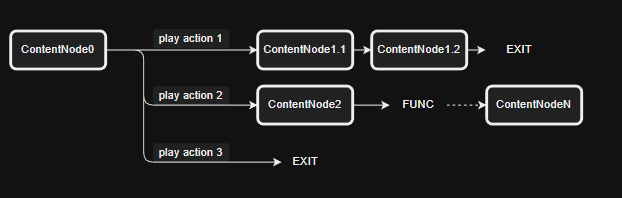

# Dialogify

一个由 配置表 构建的树形对话系统。

v1.0.2b  
by LviatYi by zewei.zhang

阅读该文档时，推荐安装以下字体：

- [JetBrainsMono Nerd Font Mono][JetbrainsMonoNerdFont]
- [Sarasa Mono SC][SarasaMonoSC]

若出现乱码，其为 Nerd Font 的特殊字符，不影响段落语义。

## Functional ⠄⠄⠄⠄⠄⠄⠄⠄⠄⠄⠄⠄⠄⠄⠄⠐⠒⠒⠒⠒⠚⠛⣿⡟⠄⠄⢠⠄⠄⠄⡄⠄⠄⣠⡶⠶⣶⠶⠶⠂⣠⣶⣶⠂⠄⣸⡿⠄⠄⢀⣿⠇⠄⣰⡿⣠⡾⠋⠄⣼⡟⠄⣠⡾⠋⣾⠏⠄⢰⣿⠁⠄⠄⣾⡏⠄⠠⠿⠿⠋⠠⠶⠶⠿⠶⠾⠋⠄⠽⠟⠄⠄⠄⠃⠄⠄⣼⣿⣤⡤⠤⠤⠤⠤⠄⠄⠄⠄⠄⠄⠄⠄⠄⠄⠄⠄⠄⠄⠄⠄

它旨在提供如下便利：

## Deficiency ⠄⠄⠄⠄⠄⠄⠄⠄⠄⠄⠄⠄⠄⠄⠄⠐⠒⠒⠒⠒⠚⠛⣿⡟⠄⠄⢠⠄⠄⠄⡄⠄⠄⣠⡶⠶⣶⠶⠶⠂⣠⣶⣶⠂⠄⣸⡿⠄⠄⢀⣿⠇⠄⣰⡿⣠⡾⠋⠄⣼⡟⠄⣠⡾⠋⣾⠏⠄⢰⣿⠁⠄⠄⣾⡏⠄⠠⠿⠿⠋⠠⠶⠶⠿⠶⠾⠋⠄⠽⠟⠄⠄⠄⠃⠄⠄⣼⣿⣤⡤⠤⠤⠤⠤⠄⠄⠄⠄⠄⠄⠄⠄⠄⠄⠄⠄⠄⠄⠄⠄

然而它亦面临无法避免的难题：

## Definite ⠄⠄⠄⠄⠄⠄⠄⠄⠄⠄⠄⠄⠄⠄⠄⠐⠒⠒⠒⠒⠚⠛⣿⡟⠄⠄⢠⠄⠄⠄⡄⠄⠄⣠⡶⠶⣶⠶⠶⠂⣠⣶⣶⠂⠄⣸⡿⠄⠄⢀⣿⠇⠄⣰⡿⣠⡾⠋⠄⣼⡟⠄⣠⡾⠋⣾⠏⠄⢰⣿⠁⠄⠄⣾⡏⠄⠠⠿⠿⠋⠠⠶⠶⠿⠶⠾⠋⠄⠽⠟⠄⠄⠄⠃⠄⠄⣼⣿⣤⡤⠤⠤⠤⠤⠄⠄⠄⠄⠄⠄⠄⠄⠄⠄⠄⠄⠄⠄⠄⠄

### E-R 实体关系图

### 叙述实体 RelateEntity

|   Name   | PropName       | Type    | Desc |
| :------: | :------------- | ------- | ---- |
|    ID    | Id             | int     |      |
|   名称   | Name           | string  |      |
|   立绘   | OriginPainting | string  |      |
| 是否主体 | IsSubjective   | boolean |      |

- **[Opt]立绘** 一种标记 ，用于记录叙述实体的立绘属性。
- **[Opt]是否主体** 一种标记 ，用于标记叙述实体的主体属性。可用于控制立绘显示位置（左/右）。

### 对话内容节点 DialogueContentNode

**对话内容节点** 即对「话」的抽象。

| Name | PropName | Type | Desc |
| :-: | :-- | --- | --- |
| ID | Id | int | 对话内容节点 Id |
| 下条内容 Id | NextId | int | 子对话内容节点 Id |
| 内容 | Content | string |  |
| 来源实体 Id | SourceId | int | 叙述实体 Id |
| 可及性对话交互节点 Ids | InteractPredNodeIds | int[][] | [对话交互节点 Id,交互条件 Id][] |

- **sourceId** 可置空 运行时置空自动继承对话树中的上一个非主体叙述实体。
  - 即自动找到上一个非主角作为此节点的来源。
- **可及性对话交互节点 Ids** 用于定义可及的对话交互节点列表。
  - 一个 [int,int] 元组的数组。
  - 第一个 int 为对话交互节点 Id。
  - 第二个 int 为交互条件 Id。

对于 NextId Content InteractPredNodeIds 分别为空，配置行的含义为：

| 置空情况 | 对话框点击反馈 | 对话内容框 | 可及交互节点列表   | 备注         |
| -------- | -------------- | ---------- | ------------------ | ------------ |
| 000      | 无             | 隐藏       | 隐藏               | 直接退出对话 |
| 001      | 无             | 隐藏       | 显示               |              |
| 010      | 退出对话       | 显示       | 隐藏               |              |
| 011      | 无             | 显示       | 显示               |              |
| ~~100~~  | ---            | ---        | ---                | 无意义的     |
| ~~101~~  | ---            | ---        | ---                | 无意义的     |
| 110      | 显示下一条     | 显示       | 隐藏               |              |
| 111      | 显示下一条     | 显示       | Content 完整后显示 |              |

一个对话从一个 **对话内容节点** 开启 ，且该节点以下属性：

- NextId
- Content
- InteractPredNodeIds

的不同状态适用于不同场合。

| 置空情况 | 屏幕点击反馈 | 对话内容框 | 可及交互节点列表   | 备注     |
| -------- | ------------ | ---------- | ------------------ | -------- |
| ~~000~~  | ---          | ---        | ---                | 无意义的 |
| 001      | 无           | 隐藏       | 显示               | **招呼** |
| 010      | 退出对话     | 显示       | 隐藏               | **打劫** |
| 011      | 无           | 显示       | 显示               | **打劫** |
| ~~100~~  | ---          | ---        | ---                | 无意义的 |
| ~~101~~  | ---          | ---        | ---                | 无意义的 |
| 110      | 显示下一条   | 显示       | 隐藏               | **打劫** |
| 111      | 无           | 显示       | Content 完整后显示 | **打劫** |

- **招呼**
  - **常用的**。
  - 不会强制锁定玩家视角。
  - 玩家可以选择交互节点 以进一步对话 从而锁定玩家视角。
- **打劫**
  - 强制锁定玩家视角。玩家被强制拉入对话。
  - 提供或不提供交互节点。
    > 到了江心 且问你吃板刀还是馄饨

### 对话交互节点 DialogueInteractNode

**对话交互节点** 象征玩家面对来自游戏角色的话语 可选择的回应。

|      Name       | PropName      | Type   | Desc              |
| :-------------: | :------------ | ------ | ----------------- |
|       ID        | Id            | int    | 对话交互节点 Id   |
| 对话内容节点 Id | ContentNodeId | int    | 子对话内容节点 Id |
|      内容       | Content       | string |                   |
| 对话节点功能 Id | FuncId        | int    | 对话节点功能 Id   |
|      图标       | Icon          | string |                   |

对于 ContentNodeId 置空性，配置行的含义为：

- 非空 跳转到对话内容节点。
- 空 直接退出对话。

### 对话节点功能 DialogueNodeFunc

定义对话节点的附带行为。

| Name | PropName | Type   | Desc |
| :--: | :------- | ------ | ---- |
|  ID  | Id       | int    |      |
| 名称 | Name     | string |      |
| 行为 | Behavior | FUNC   |      |

- **[FUNC]行为** 由程序提供。

### 交互条件 InteractPredicate

用于决定 对话内容节点 所引出的 对话交互节点 是否可用。

| Name | PropName | Type   | Desc |
| :--: | :------- | ------ | ---- |
|  ID  | Id       | int    |      |
| 名称 | Name     | string |      |
| 行为 | Behavior | FUNC   |      |

- **[FUNC]行为** 由程序提供，给定参数，返回一个 boolean 。

## Instruct ⠄⠄⠄⠄⠄⠄⠄⠄⠄⠄⠄⠄⠄⠄⠄⠐⠒⠒⠒⠒⠚⠛⣿⡟⠄⠄⢠⠄⠄⠄⡄⠄⠄⣠⡶⠶⣶⠶⠶⠂⣠⣶⣶⠂⠄⣸⡿⠄⠄⢀⣿⠇⠄⣰⡿⣠⡾⠋⠄⣼⡟⠄⣠⡾⠋⣾⠏⠄⢰⣿⠁⠄⠄⣾⡏⠄⠠⠿⠿⠋⠠⠶⠶⠿⠶⠾⠋⠄⠽⠟⠄⠄⠄⠃⠄⠄⣼⣿⣤⡤⠤⠤⠤⠤⠄⠄⠄⠄⠄⠄⠄⠄⠄⠄⠄⠄⠄⠄⠄⠄

允许通过 Excel 或 Json 进行 ER 关系定义。

### Excel ⠄⠄⠄⠄⠄⠄⠄⠄⠄⠄⠄⠄⠄⠄⠄⠐⠒⠒⠒⠒⠚⠛⣿⡟⠄⠄⢠⠄⠄⠄⡄⠄⠄⣠⡶⠶⣶⠶⠶⠂⣠⣶⣶⠂⠄⣸⡿⠄⠄⢀⣿⠇⠄⣰⡿⣠⡾⠋⠄⣼⡟⠄⣠⡾⠋⣾⠏⠄⢰⣿⠁⠄⠄⣾⡏⠄⠠⠿⠿⠋⠠⠶⠶⠿⠶⠾⠋⠄⠽⠟⠄⠄⠄⠃⠄⠄⣼⣿⣤⡤⠤⠤⠤⠤⠄⠄⠄⠄⠄⠄⠄⠄⠄⠄⠄⠄⠄⠄⠄⠄

### Json ⠄⠄⠄⠄⠄⠄⠄⠄⠄⠄⠄⠄⠄⠄⠄⠐⠒⠒⠒⠒⠚⠛⣿⡟⠄⠄⢠⠄⠄⠄⡄⠄⠄⣠⡶⠶⣶⠶⠶⠂⣠⣶⣶⠂⠄⣸⡿⠄⠄⢀⣿⠇⠄⣰⡿⣠⡾⠋⠄⣼⡟⠄⣠⡾⠋⣾⠏⠄⢰⣿⠁⠄⠄⣾⡏⠄⠠⠿⠿⠋⠠⠶⠶⠿⠶⠾⠋⠄⠽⠟⠄⠄⠄⠃⠄⠄⣼⣿⣤⡤⠤⠤⠤⠤⠄⠄⠄⠄⠄⠄⠄⠄⠄⠄⠄⠄⠄⠄⠄⠄

[JetbrainsMonoNerdFont]: https://github.com/ryanoasis/nerd-fonts/releases/download/v3.0.2/JetBrainsMono.zip@fallbackFont
[SarasaMonoSC]: https://github.com/be5invis/Sarasa-Gothic/releases/download/v0.41.6/sarasa-gothic-ttf-0.41.6.7z
