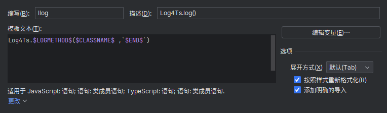

# Log4Ts

Log4Ts 日志管理 in pure typescript。提供统一的日志管理以及简单的过滤功能。

v1.4.3  
by LviatYi

阅读该文档时，推荐安装以下字体：

- [JetBrainsMono Nerd Font Mono][JetbrainsMonoNerdFont]
- [Sarasa Mono SC][SarasaMonoSC]

若出现乱码，其为 Nerd Font 的特殊字符，不影响段落语义。

## Functional ⠄⠄⠄⠄⠄⠄⠄⠄⠄⠄⠄⠄⠄⠄⠄⠐⠒⠒⠒⠒⠚⠛⣿⡟⠄⠄⢠⠄⠄⠄⡄⠄⠄⣠⡶⠶⣶⠶⠶⠂⣠⣶⣶⠂⠄⣸⡿⠄⠄⢀⣿⠇⠄⣰⡿⣠⡾⠋⠄⣼⡟⠄⣠⡾⠋⣾⠏⠄⢰⣿⠁⠄⠄⣾⡏⠄⠠⠿⠿⠋⠠⠶⠶⠿⠶⠾⠋⠄⠽⠟⠄⠄⠄⠃⠄⠄⣼⣿⣤⡤⠤⠤⠤⠤⠄⠄⠄⠄⠄⠄⠄⠄⠄⠄⠄⠄⠄⠄⠄⠄

它旨在提供如下便利：

- [x] **因时制宜** 使用 DebugLevels 对日志进行分级控制。
- [x] **恰如其分** 提供过滤功能，与 gitignore 配合实现客制化的日志选项。
- [x] **主次分明** 对多行日志进行标题与缩进控制，以提升可读性。
- [x] **客随主便** 永不抛出异常，即使传入了错误的参数或 MessageGetter。
- [x] **蓄盈待竭** 将日志行打包为块处理。
- [x] **抽丝剥茧** 自动识别 Error 并暴露堆栈信息。

## Example ⠄⠄⠄⠄⠄⠄⠄⠄⠄⠄⠄⠄⠄⠄⠄⠐⠒⠒⠒⠒⠚⠛⣿⡟⠄⠄⢠⠄⠄⠄⡄⠄⠄⣠⡶⠶⣶⠶⠶⠂⣠⣶⣶⠂⠄⣸⡿⠄⠄⢀⣿⠇⠄⣰⡿⣠⡾⠋⠄⣼⡟⠄⣠⡾⠋⣾⠏⠄⢰⣿⠁⠄⠄⣾⡏⠄⠠⠿⠿⠋⠠⠶⠶⠿⠶⠾⠋⠄⠽⠟⠄⠄⠄⠃⠄⠄⣼⣿⣤⡤⠤⠤⠤⠤⠄⠄⠄⠄⠄⠄⠄⠄⠄⠄⠄⠄⠄⠄⠄⠄

### Config

支持 **自定义配置** 以对你的环境进行私有的日志输出配置。以下是操作步骤：

1. 在该文件夹下建立 Log4TsSelfConfig.ts 文件

   如 `/project/JavaScripts/depends/log4ts/Log4TsSelfConfig.ts`

2. 在该文件中编写配置

    ```typescript
    // recommend to add this file in gitignore
    // Log4TsSelfConfig.ts
    
    import Log4Ts, { Log4TsConfig } from "./Log4Ts";
    
    Log4Ts.setConfig(
        new Log4TsConfig()
            .addBlackList("IDontWantThis"),
    );
    ```

3. 将文件在 gitignore 中忽略

    ```gitignore
    # Custom
    Log4TsSelfConfig.ts
    ```

### Chunk

使用 `setChunkHandler` 与 `setChunkSize` 配置日志缓存块的处理方式与大小。

 ```typescript
 // recommend to add this file in gitignore

import Log4Ts, {Log4TsConfig} from "./Log4Ts";

Log4Ts.setConfig(
        new Log4TsConfig()
                .setChunkHandler((chunk) => {
                    console.log(chunk);
                })
                .setChunkSize() // set size 1
                .setChunkSize(50), // 当未调用过 setChunkSize 时，使用默认值 50
);
 ```

由于某些运行时 TypeScript 版本限制，无法使用 TypeScript5.2 的 Dispose 特性。建议在生命周期结束后，手动调用最后一次未满的
Chunk 处理。

```typescript
import Log4Ts from "./Log4Ts";

Log4Ts.forceHandleChunk();
```

## Snippet ⠄⠄⠄⠄⠄⠄⠄⠄⠄⠄⠄⠄⠄⠄⠄⠐⠒⠒⠒⠒⠚⠛⣿⡟⠄⠄⢠⠄⠄⠄⡄⠄⠄⣠⡶⠶⣶⠶⠶⠂⣠⣶⣶⠂⠄⣸⡿⠄⠄⢀⣿⠇⠄⣰⡿⣠⡾⠋⠄⣼⡟⠄⣠⡾⠋⣾⠏⠄⢰⣿⠁⠄⠄⣾⡏⠄⠠⠿⠿⠋⠠⠶⠶⠿⠶⠾⠋⠄⠽⠟⠄⠄⠄⠃⠄⠄⣼⣿⣤⡤⠤⠤⠤⠤⠄⠄⠄⠄⠄⠄⠄⠄⠄⠄⠄⠄⠄⠄⠄⠄

Snippet 是一种由 IDE 支持的代码片段，允许通过简写来快速输入重复的代码模式。

如，以下配置允许你仅输入 `llog` 即可生成包含所在类名或文件名的 Log4Ts 的日志输出代码。

### Visual Studio Code

```json
{
    "Log4Ts": {
        "prefix": "llog",
        "body": [
            "Log4Ts.${1:log}(${TM_FILENAME_BASE} ,`${2:message}`)"
        ],
        "description": "Log with Log4Ts"
    }
}
```

### JetBrains



```ts
Log4Ts.$LOGMETHOD$($CLASSNAME$, `$END$`)
```

[JetbrainsMonoNerdFont]: https://github.com/ryanoasis/nerd-fonts/releases/download/v3.0.2/JetBrainsMono.zip@fallbackFont

[SarasaMonoSC]: https://github.com/be5invis/Sarasa-Gothic/releases/download/v0.41.6/sarasa-gothic-ttf-0.41.6.7z
